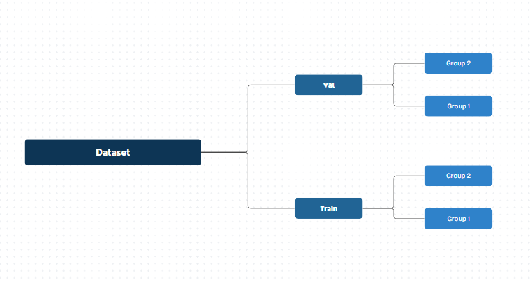

---
---
# Tutorial:  
## AI Image Training With Google Colaboratory  
This tutorial will explain how to set up, train, and test an instance of PyTorch AI. Specifically training and testing it in image recognition: to be able to interperate images and visual data in a way that is helpful for us.
### Step 1: Set Up  

we will be using python in google colab for this type of training. A general knowledge of Python code would be helpful. In addition to this, you will need a dataset already prepared in your google drive with a file layout like this: 




  The more images you have for training, the better. The images should all be high quality and there should be about 80% in the training folder, which is for training the AI, and 20% in the val folder which is for testing the AI.

  Once your dataset is set up, sign into Google Colaboratory using a Google account.  
  
  Next, Create a new Notebook through Google Colab or Google Drive. Google Colab is connected to other Google applications on the account and "Notebooks" created can be managed in Google Drive. Notebooks in Google Colab are documents that can hold both text and executable code. Or, in our case, Notebooks allow users to easily access PyTorch AI and Images in our Google Drive in the same document and help us easily export the AI when training is finished.

Add necessary imports at the top of your code cell

We need to import our Drive files as well as the necessary PyTorch resources before we start using it.   
Here are the imports we need:  

```
import torch
import torch.nn as nn
import torch.optim as optim
from torch.utils.data import DataLoader
from torchvision import datasets, transforms, models
from google.colab import drive
```

### Step 2: Dataset
In order to train the AI in image recognition, you need to have a dataset ready to train it with. Use this command next to point to the location of your dataset in your Google Drive.
```
data_dir = "/content/drive/MyDrive/dataset"
```

The dataset needs to be in a very specific file structure divided into validation and training directories, but ill assume the dataset is setup correctly for the purposes of this tutorial.

Then add these lines of code:
```
transform = transforms.Compose([
    transforms.Resize((224, 224)), 
    transforms.ToTensor(), 
    transforms.Normalize([0.485, 0.456, 0.406], 
                         [0.229, 0.224, 0.225])
])

train_dataset = datasets.ImageFolder(root=f"{data_dir}/train", transform=transform)
val_dataset   = datasets.ImageFolder(root=f"{data_dir}/val", transform=transform)

train_loader = DataLoader(train_dataset, batch_size=32, shuffle=True)
val_loader   = DataLoader(val_dataset, batch_size=32, shuffle=False)
```
The transform value will prepare all the images and make them the same size, this consistency helps the AI learn more consistently. 

The following lines load the two directories from the dataset and divide them into groups of 32

### Step 3: Model

For this step add the following lines:
```
device = "cuda" if torch.cuda.is_available() else "cpu"
```
This line tells the system to use the GPU if it is enabled and use the CPU otherwise
```
model = models.mobilenet_v2(weights="IMAGENET1K_V1")
```
This line loads in a pretrained mobileNet AI model. Starting from a pretrained model is much faster than starting from scratch with a new model.

```
for param in model.features.parameters():
    param.requires_grad = False
```
This freexes the feature extractor which makes the learning faster

```
num_classes = len(train_dataset.classes)
model.classifier[1] = nn.Linear(model.last_channel, num_classes)
```
And this tells the model how many classes you are training it in.

### Step 4: Training

Now that the AI model is set up, we can add the code necessary to actually start training.

```
criterion = nn.CrossEntropyLoss()
optimizer = optim.Adam(model.parameters(), lr=0.001)
```
The first line of code here sets the loss function. Aloss function in machine learning is a function that quantifies the value between the predicted outputs and actual results. It helps to guage the performance of the AI.

And the second line sets the Optimizer to Adam which is a commonly used and well working Optimizer.

Next you want to create a variable called epochs(which is a machine learning tem used to mean an entire pass through a dataset) and set it to however many epochs you want, i will start with 5

```
epochs = 5
```
Next, this is the code that will run to actually train and gather data on the AI model and it will repeat for each epoch

```
for epoch in range(epochs):
    model.train()
    
    # Training loop
    optimizer.zero_grad()
    outputs = model(images)
    loss = criterion(outputs, labels)
    loss.backward()
    optimizer.step()
```
once this has run, you can use the following line to print the results for this training session:

```
print(f"Epoch {epoch+1}/{epochs}, Loss: ..., Val Acc: ...")
```

Using the tools in this tutorial, different datasets, and modifying variables based on the test results, you may be able to train an AI model in image recognition. For more information on the tools used, here are links to the documentation for each below.

## See Also

[Google Colab Documentation](https://docs.cloud.google.com/colab/docs)

[PyTorch Documentation](https://docs.pytorch.org/docs/stable/index.html)